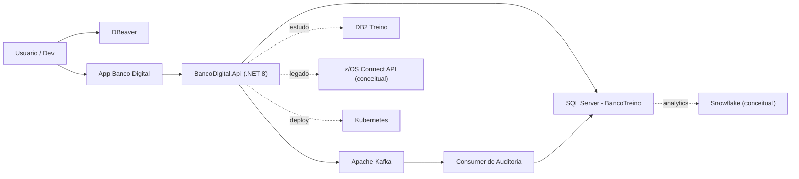
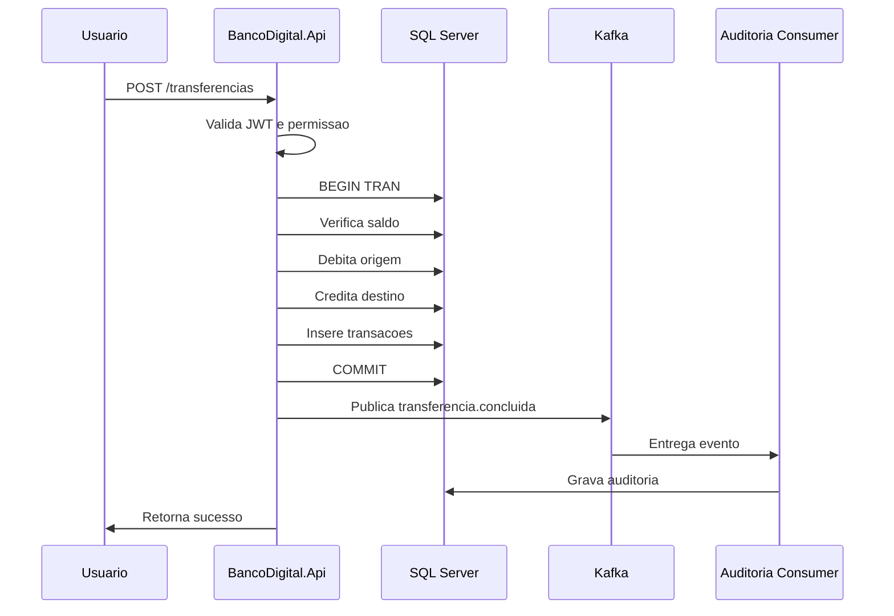

# Arquitetura

## Desenho geral



## Camadas

### Interface

No inicio, vamos criar apenas API. Depois podemos adicionar frontend.

Primeira interface:

- Swagger/OpenAPI.
- DBeaver para SQL.
- Postman/Insomnia ou navegador para testar endpoints.

### API

Projeto principal:

```text
BancoDigital.Api
```

Responsabilidades:

- Receber requisicoes HTTP.
- Validar entrada.
- Autenticar usuario.
- Autorizar operacoes.
- Chamar regras de negocio.
- Ler e gravar no SQL Server.
- Publicar eventos no Kafka.

### Dominio

Regras bancarias:

- Cliente pode consultar apenas suas contas.
- Transferencia precisa validar saldo.
- Operacao precisa gerar transacao.
- Operacao sensivel precisa gerar auditoria.
- Dados sensiveis nao devem aparecer em logs.

### Banco transacional

SQL Server com base `BancoTreino`.

Guarda:

- Clientes.
- Contas.
- Transacoes.
- Cartoes.
- Emprestimos.
- Auditoria.

### Mensageria

Kafka.

Eventos:

- `cliente.autenticado`
- `conta.consultada`
- `transacao.criada`
- `transferencia.solicitada`
- `transferencia.concluida`
- `auditoria.registrada`

### Deploy

Kubernetes.

Objetos planejados:

- Deployment da API.
- Service da API.
- ConfigMap para configuracoes.
- Secret para senha do banco.
- Deployment de consumer Kafka.

## Fluxo de transferencia



## Principios

- Comecar simples.
- Usar a base existente.
- Fazer seguranca desde o inicio.
- Separar regra de negocio da API.
- Registrar eventos importantes.
- Documentar cada decisao.

