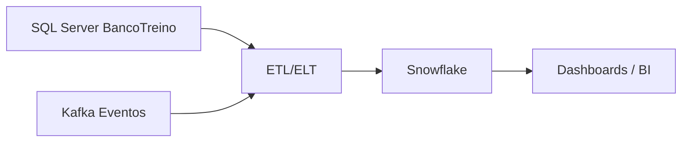

# Snowflake E Analytics

## Papel do Snowflake

Snowflake nao sera implementado agora.

Ele entra como leitura e desenho de arquitetura analitica.

## Diferenca principal

SQL Server no projeto:

- Banco transacional.
- Usado pela aplicacao.
- Dados operacionais.
- Consultas de cliente, saldo e transacao.

Snowflake:

- Data warehouse.
- Usado para analytics.
- Dados historicos.
- Relatorios, BI e analise.

## Exemplo de fluxo

## O que estudar

- Database.
- Schema.
- Warehouse.
- Stage.
- Role.
- ELT.
- Carga incremental.
- Dados historicos.

## Tabelas analiticas futuras

- `FATO_TRANSACOES`
- `DIM_CLIENTE`
- `DIM_CONTA`
- `DIM_TEMPO`
- `FATO_EMPRESTIMOS`

## Pergunta de entrevista

Por que nao usar o SQL Server transacional direto para BI pesado?

Resposta esperada:

Porque consultas analiticas pesadas podem competir com a aplicacao transacional. Um data warehouse separa cargas operacionais de cargas analiticas.

