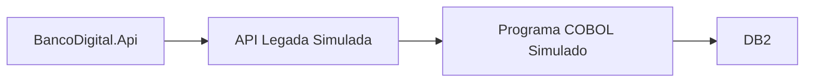

# zOS Connect

## Papel do z/OS Connect

z/OS Connect e uma tecnologia IBM usada para expor recursos de mainframe como APIs.

Em bancos, sistemas antigos podem estar em:

- COBOL.
- CICS.
- IMS.
- DB2 for z/OS.

O z/OS Connect ajuda a transformar esses recursos em APIs REST.

## Como entra no nosso projeto

Neste projeto, ele entra como estudo conceitual.

Simulacao futura:



## O que estudar

- API Provider.
- API Requester.
- OpenAPI.
- Mapping.
- Service Archive.
- Integracao com CICS.
- Integracao com COBOL.

## Exemplo conceitual

Uma API moderna chama:

```http
GET /legado/clientes/{cpf}
```

Por tras, o z/OS Connect chama um programa COBOL que consulta dados no mainframe.

## Relacao com DB2

DB2 pode representar a camada de dados legada.

z/OS Connect representa a camada que exporia essa informacao como API.

